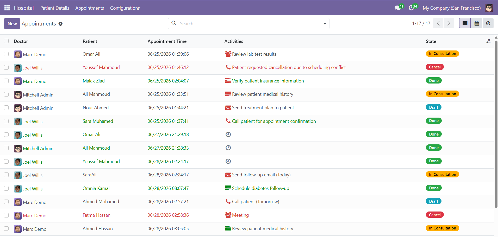
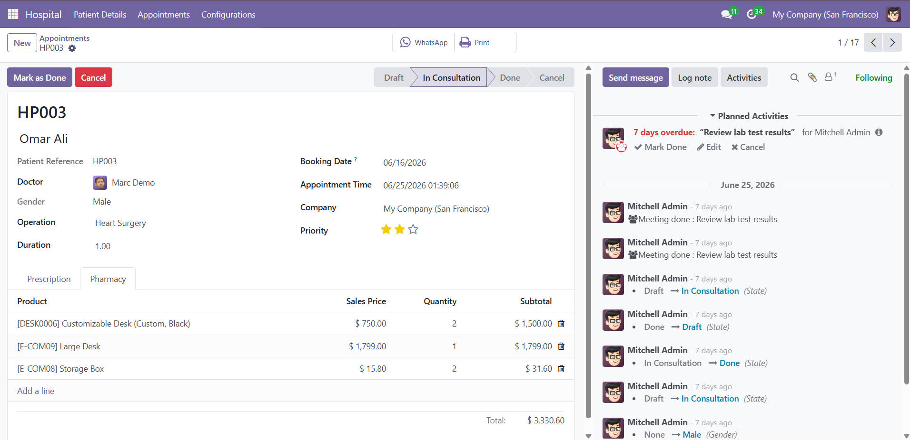
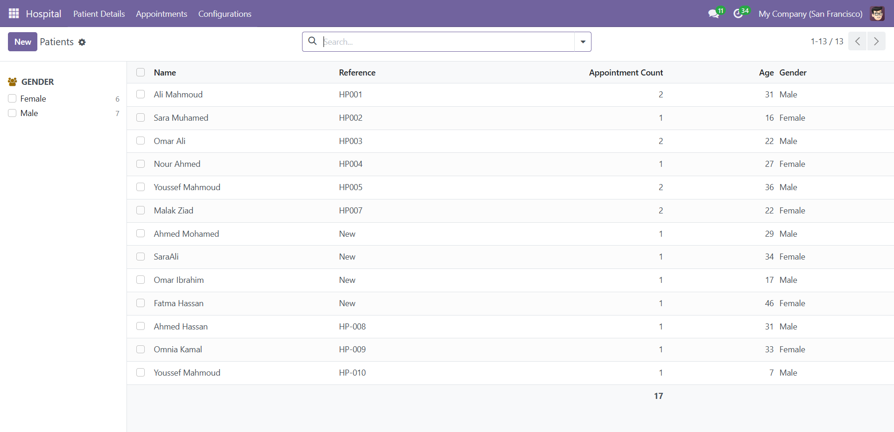
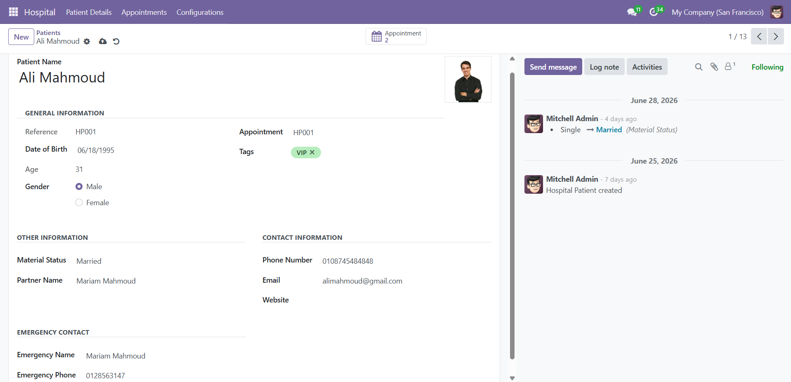
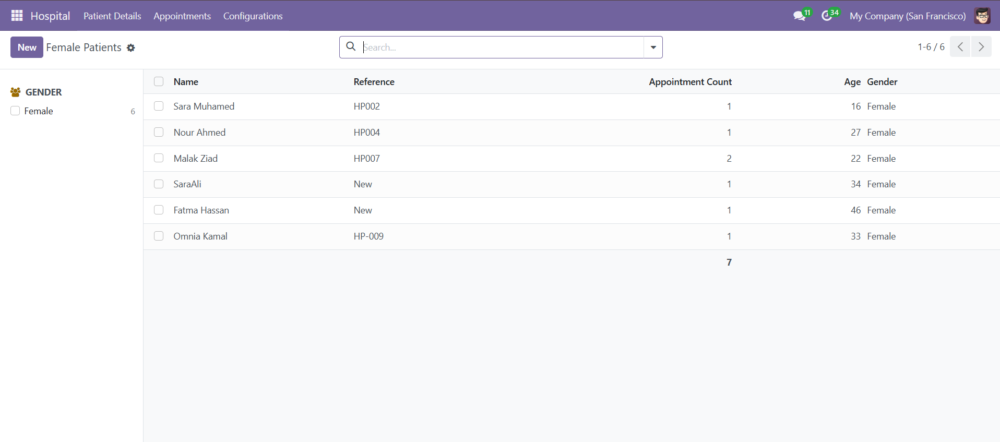
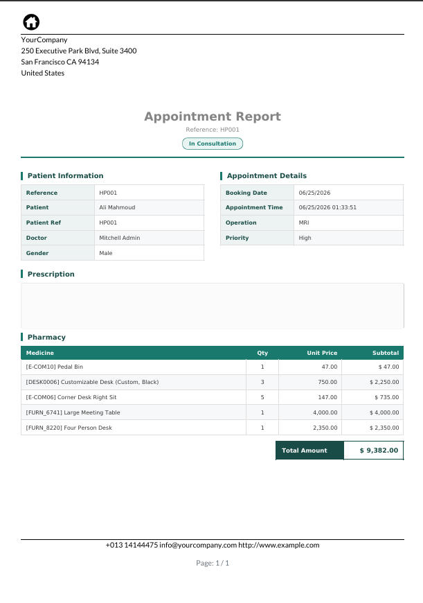

# 🏥 Hospital Management | Odoo 17

A custom Hospital Management module built for **Odoo 17** that helps manage patients, appointments, medical operations, pharmacy items, reports, and hospital configurations.

---

# Features

## 📅 Appointment Management

- Create and manage appointments.
- Automatic appointment sequence generation.
- Appointment workflow:
  - Draft
  - In Consultation
  - Done
  - Cancel
- Assign doctors.
- Booking date.
- Appointment time.
- Priority management.

---

## 👨‍⚕️ Patient Management

- Manage patient records.
- Automatic patient reference sequence.
- Gender management.
- Patient tags.
- Female patients action.

---

## 🏷️ Patient Tags

Manage patient tags with:

- Name
- Active
- Color

---

## 🩺 Hospital Operations

Manage medical operations that can be assigned to appointments.

---

## 💊 Pharmacy

Each appointment supports pharmacy items including:

- Product
- Quantity
- Sales Price
- Subtotal

---

## 📆 Calendar View

Appointments can be managed through the Calendar View.

---

## ✅ Activities

Appointments support scheduled activities using Odoo Activities.

---

## ⚙️ Configuration

Hospital settings include:

- Appointment cancellation days.

---

## ❌ Appointment Cancellation Wizard

Cancel appointments using a dedicated wizard.

---

## 💬 WhatsApp Integration

Generate a WhatsApp message containing the appointment reference.

---

## 📄 PDF Report

Generate an Appointment Report containing:

- Patient Information
- Appointment Details
- Pharmacy Products
- Total Amount

---

# Module Structure

```text
hospital_management/
│
├── data/
│   ├── appointment_sequence.xml
│   ├── patient_sequence.xml
│   └── patient_tag_data.xml
│
├── models/
│   ├── __init__.py
│   ├── appointment.py
│   ├── hospital_config_settings.py
│   ├── hospital_operation.py
│   ├── patient.py
│   └── patient_tag.py
│
├── report/
│   └── appointment_report.xml
│
├── screenshots/
│   └── *.png
│
├── security/
│   └── ir.model.access.csv
│
├── static/
│   └── description/
│       └── icon.png
│
├── views/
│   ├── appointment_view.xml
│   ├── base_menu.xml
│   ├── female_patient_view.xml
│   ├── hospital_config_settings_view.xml
│   ├── hospital_operation_view.xml
│   ├── patient_tag_view.xml
│   └── patient_view.xml
│
├── wizard/
│   ├── __init__.py
│   ├── cancel_appointment.py
│   └── cancel_appointment_view.xml
│
├── .gitignore
├── __init__.py
├── __manifest__.py
└── README.md
```

---

# Technologies

- Odoo 17
- Python
- XML
- PostgreSQL
- QWeb Reports

---

# Installation

1. Copy the module into your custom addons directory.
2. Restart the Odoo server.
3. Update the Apps List.
4. Install **Hospital Management**.

---

# Screenshots

## Appointments List View



---

## Appointment Form View



---

## Appointment Calendar View

![Appointment Calendar]

---

## Appointment Activities

![Appointment Activities]

---

## Patient List View



---

## Patient Form View



---

## Female Patients Action



---

## Patient Tags

![Patient Tags]

---

## Hospital Operations

operation_records.png.png]

---

## Hospital Configuration

.png](screenshots/Hospital%20Configuration%20%28Settings%29.png)Hospital Configuration (Settings).png)

---

## WhatsApp Integration


---

## Appointment PDF Report



---

# Author

**Muhamed Helmy**

---

# License

This project was developed for learning, practice, and portfolio purposes.